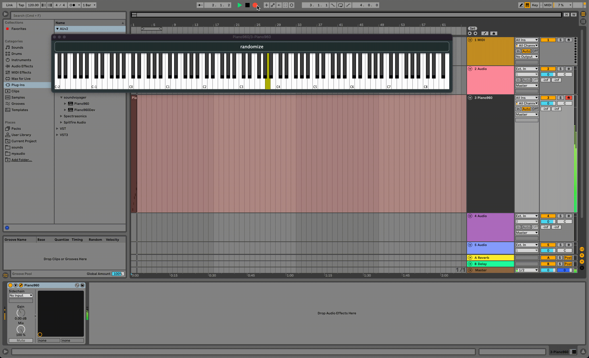

# Piano960


Piano960 is a cross platform audio plugin: a virtual keyboard where every key plays a different, random audio clip. Each of these audio clips is pitch shifted to match the frequency of the note for the corresponding key.



---

<div align="center">
  <b> Here's a short audio clip demonstrating one example of what the instrument can sound like. </b>
  <br>
  <br>
</div>

https://user-images.githubusercontent.com/19389561/207800053-8ebb1fd1-1be0-4011-ad29-069673584649.mp4

---

## Supported Formats:

- [AU](https://en.wikipedia.org/wiki/Audio_Units)
- [VST](https://en.wikipedia.org/wiki/Virtual_Studio_Technology)
- [VST3](https://en.wikipedia.org/wiki/Virtual_Studio_Technology)

## Building the Plugin

To build the plugin with CMake:

```bash
mkdir build && cd build
cmake .. -DCMAKE_INSTALL_PREFIX=/usr/local
make install
```

To quickly build and install Piano960, use the `build.sh` convencience script with an `-i` option. (you might have to change the file permision: `chmod +x ./bs` ).

```bash
bs -i
```

#### Build Script Options

```shell
options:
v   output excessive debug info to stdout
s   supress cmake output
t   build and run unit tests
i   locally install samples, pitch detection models, and presets
c   Clean any existing and build the plugin from scratch
2   use spice model for pitch detection
3   use crepe model for pitch detection
d   sets the CMAKE build type to Debug
e   enables GPU for tensorflow operations
g   compile with GCC
f   only run fast tests (i.e. no pitch detection tests)
l   turns on the logger, which writes verbose messages to a logfile
u   can be used to pass arguments into unit test build
```

### Building with Ubuntu/Debian-like Distributions

For Ubuntu/Debian-like distributions, the JUCE framework has couple of dependencies that must be installed.

- libgl1-mesa-dev
- xorg-dev

Install the dependencies with `apt-get`:

```console
apt-get install libxcursor-dev libxrandr-dev libxinerama-dev libxi-dev libasound2-dev
```

## Unit Testing

Use `build.sh` with a `-t` option to build and run the unit tests.

```bash
Piano960 % ./bs -t
[ 78%] Built target Catch2
[ 95%] Built target Piano960Plugin
[ 96%] Building CXX object Tests/CMakeFiles/unit-tests.dir/pitch_detection_tests.cpp.o
[ 97%] Building CXX object Tests/CMakeFiles/unit-tests.dir/processor_test.cpp.o
[ 98%] Linking CXX executable unit-tests
[100%] Built target unit-tests
JUCE v7.0.3
Randomness seeded to: 2100061589
Using YIN pitch detection algorithm.
===============================================================================
All tests passed (77 assertions in 32 test cases)
```

>>> The pitch detection tests are relatively slow, but you can use a `-tf` option to exclude the slow tests.

## Xcode Integration

To integrate and build the plugin with Xcode, use [Projucer](https://docs.juce.com/master/tutorial_new_projucer_project.html) along with the `Piano960.jucer` file, which can be found in the `Config` directory.

This is completely optional, and unit testing is not supported by this build process. 

## Samples

Samples are randomly compiled from [Piano960-Sample-Sets](https://github.com/perintyler/Piano960-Sample-Packs/tree/3cd9a87cd744546126fbd789f81a77e3cdff23df) to the [`Resources`](https://github.com/perintyler/Piano960/tree/main/Resources) directory via the [`compile_samples.py` script](https://github.com/perintyler/Piano960/blob/main/Scripts/compile_samples.py). Any set of samples and sample packs can be used by using the script's `--sample-packs` argument.

```bash
python3 Scripts/compile_samples.py --sample-packs path/to/my/samples
```

There's a bunch of sample manipulation scripts in the `Scripts` directory:
- `clean_packs.py`: this script will cleanse sample packs of non `.wav` files
- `compile_samples.py`: this script will crawl through a nested directories structure, finding wav files to popule the `Resouces` folder
- `compile_test_data.py`: this is a convenience script for finding/naming/saving audio files that can be used for unit tests
- `trim_samples.py`: this script trims every installed sample to a fixed length
- `normalize_samples`: this script makes sure that the volume levels of each installed sample is about the same

## Pitch Detection

I'm still experimenting with pitch detection. An accurate and fast pitch detection algorithm is neccessary to detect the fundemental frequency of samples, which is neccessary when assigning random samples to MIDI keys, since each key must produce a specific pitch, meaning the sample must be transposed.

This codebase currently supports 3 different pitch detection algorithm. The desired algorithm can be specified with a CMAKE argumet: `-DPITCH_DETECTION_ALGORITHM`. The options are:

1. `-DPITCH_DETECTION_ALGORITHM=YIN`
2. `-DPITCH_DETECTION_ALGORITHM=SPICE`
3. `-DPITCH_DETECTION_ALGORITHM=CREPE`

NOTE: Each algorithm currently exists as different builds because Tensorflow is a giant build dependency. The branching builds will be consolidated when pitch detection is ironed out.

>>> use the build script (`bs`) and a `-g` to enable GPU usage, which will make `crepe` and `spice` faster

### [YIN Algorithm](http://audition.ens.fr/adc/pdf/2002_JASA_YIN.pdf) 

As of now, the YIN implementation will successfully identify the correct note of a sample (i.e. A, A#, B, ...), but won't always be able to identify the correct octave of the sample. A couple of the unit tests are still failing...

### Spice Model (Tensorflow Lite)

[The Spice model is a pitch detection model](https://www.tensorflow.org/hub/tutorials/spice) hosted on the Tensorflow model hub. The downside of this model is it requires 10 seconds of audio to work. Also, this model has complications with dynamic sized tensors, but the tensorflow lite c++ API only has experimental support for dynamic sized tensors.

NOTE: WIP

### Crepe Model (Tensorflow Lite)

The Crepe Pitch Detection Model seems to give the fastest and most accurate results. The models are build by the `Models/build_models.sh` bash script, which creates `.tflite` files of varying sizes and puts them in `Models/crepe-models`.

NOTE: WIP

## Presets

Presets allow users to quickly load keyboard configurations from a previously curated sample set. Piano960 provides default presets that are bundled with the plugin by default, but users can also save their own presets to be re-loaded later on. Presets are saved in a JSON file installed to the `include` directory, so they will persist across plugin uses.  